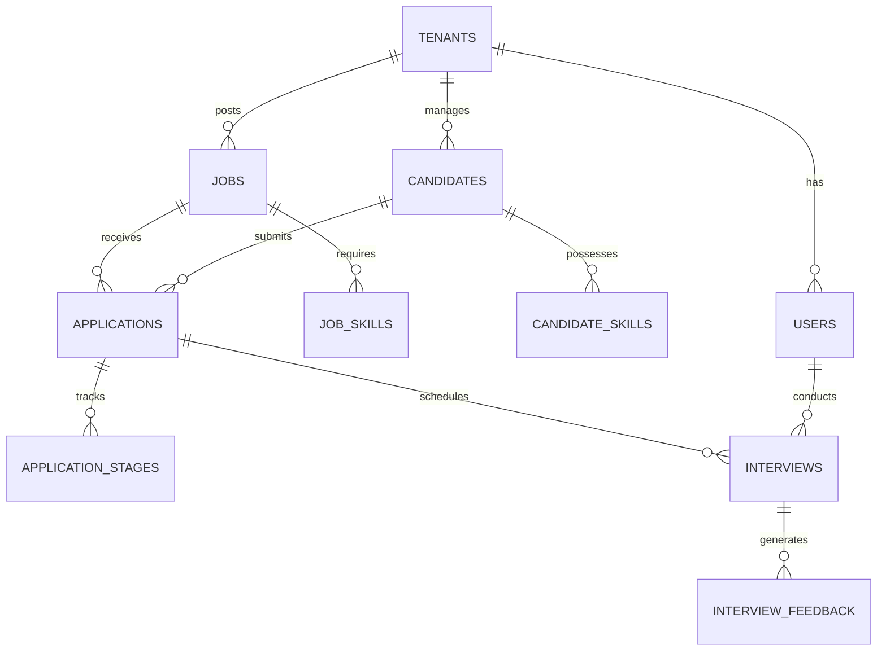

# ATS Database Operations Guide

## Table of Contents
- [Database Indexes](#database-indexes)
  - [Core Table Indexes](#core-table-indexes)
  - [Full-Text Search Indexes](#full-text-search-indexes)
- [Common Operations](#common-operations)
  - [Candidate Search](#candidate-search)
  - [Pipeline Analytics](#pipeline-analytics)
  - [Interview Scheduling](#interview-scheduling)
- [Performance Optimization](#performance-optimization)
  - [Materialized Views](#materialized-views)
  - [Partitioning Strategy](#partitioning-strategy)
- [Data Relationships](#data-relationships)
  - [Entity Relationships](#entity-relationships)
  - [Referential Integrity](#referential-integrity)
- [Monitoring & Maintenance](#monitoring--maintenance)
  - [Performance Monitoring](#performance-monitoring)
  - [Maintenance Procedures](#maintenance-procedures)
  - [Monitoring Queries](#monitoring-queries)

> 📌 **Looking for database structure?** Check the [Database Structure Guide](/docs/technical/database-structure.md)

## Quick Links
- [Database Structure](/docs/technical/database-structure.md) - Core database architecture
- [API Documentation](/docs/api/README.md) - API implementation
- [Performance Guide](/docs/guides/best-practices/performance.md) - Performance best practices

## Related Features
- [Analytics Dashboard](/docs/features/analytics-dashboard.md) - Using analytics features
- [Reporting System](/docs/features/reporting-system.md) - Custom reports
- [Data Export](/docs/features/data-export.md) - Data export functionality

## Admin Resources
- [Database Configuration](/docs/guides/admin/database-config.md)
- [Backup Procedures](/docs/guides/admin/backup-procedures.md)
- [Monitoring Setup](/docs/guides/admin/monitoring-setup.md)

## Related Documentation
- [Database Structure](/docs/technical/database-structure.md)
- [API Documentation](/docs/api/README.md)
- [Performance Best Practices](/docs/guides/best-practices/performance.md)
- [Data Management Guide](/docs/guides/best-practices/data-management.md)

## See Also
- [Candidate Pipeline Documentation](/docs/features/candidate-pipeline.md)
- [Interview Management](/docs/features/structured-interviews.md)
- [Analytics Implementation](/docs/features/analytics-dashboard.md)

## Database Indexes

### Core Table Indexes
```sql
-- Users Table Indexes
CREATE INDEX idx_users_email ON users(email) WHERE deleted_at IS NULL;
CREATE INDEX idx_users_tenant ON users(tenant_id);
CREATE INDEX idx_users_role ON users(role);

-- Jobs Table Indexes
CREATE INDEX idx_jobs_status ON jobs(status);
CREATE INDEX idx_jobs_tenant_status ON jobs(tenant_id, status);
CREATE INDEX idx_jobs_department ON jobs(department);
CREATE INDEX idx_jobs_location ON jobs(location);
CREATE INDEX idx_jobs_created_at ON jobs(created_at);

-- Candidates Table Indexes
CREATE INDEX idx_candidates_email ON candidates(email);
CREATE INDEX idx_candidates_tenant_status ON candidates(tenant_id, status);
CREATE INDEX idx_candidates_location ON candidates(location);
CREATE INDEX idx_candidates_source ON candidates(source);

-- Applications Table Indexes
CREATE INDEX idx_applications_status ON applications(status);
CREATE INDEX idx_applications_stage ON applications(stage);
CREATE INDEX idx_applications_tenant_status ON applications(tenant_id, status);
CREATE INDEX idx_applications_applied_at ON applications(applied_at);

-- Interviews Table Indexes
CREATE INDEX idx_interviews_scheduled_at ON interviews(scheduled_at);
CREATE INDEX idx_interviews_interviewer ON interviews(interviewer_id);
CREATE INDEX idx_interviews_tenant_status ON interviews(tenant_id, status);
```

### Full-Text Search Indexes
```sql
-- Jobs Full-Text Search
ALTER TABLE jobs ADD COLUMN search_vector tsvector;
CREATE INDEX idx_jobs_search ON jobs USING gin(search_vector);

-- Update trigger for jobs search
CREATE TRIGGER jobs_search_update
    BEFORE INSERT OR UPDATE ON jobs
    FOR EACH ROW
    EXECUTE FUNCTION update_jobs_search_vector();

-- Candidates Full-Text Search
ALTER TABLE candidates ADD COLUMN search_vector tsvector;
CREATE INDEX idx_candidates_search ON candidates USING gin(search_vector);

-- Update trigger for candidates search
CREATE TRIGGER candidates_search_update
    BEFORE INSERT OR UPDATE ON candidates
    FOR EACH ROW
    EXECUTE FUNCTION update_candidates_search_vector();
```

## Common Operations

### Candidate Search and Filtering
```sql
-- Search candidates by skills and experience
WITH candidate_skills_agg AS (
    SELECT 
        candidate_id,
        jsonb_object_agg(skill_name, jsonb_build_object(
            'years', years_experience,
            'level', proficiency_level
        )) as skills
    FROM candidate_skills
    GROUP BY candidate_id
)
SELECT 
    c.*,
    csa.skills,
    COUNT(*) OVER() as total_count
FROM candidates c
LEFT JOIN candidate_skills_agg csa ON c.id = csa.candidate_id
WHERE c.tenant_id = :tenant_id
    AND (
        :skill_name IS NULL 
        OR EXISTS (
            SELECT 1 FROM candidate_skills cs 
            WHERE cs.candidate_id = c.id 
                AND cs.skill_name = :skill_name
                AND cs.years_experience >= :min_years
        )
    )
    AND (:location IS NULL OR c.location = :location)
    AND (:status IS NULL OR c.status = :status)
ORDER BY c.created_at DESC
LIMIT :limit OFFSET :offset;
```

### Application Pipeline Analytics
```sql
-- Get application funnel metrics
WITH stage_counts AS (
    SELECT 
        j.title as job_title,
        ast.stage_name,
        COUNT(*) as count,
        COUNT(*) * 100.0 / SUM(COUNT(*)) OVER (PARTITION BY j.id) as percentage
    FROM applications a
    JOIN jobs j ON a.job_id = j.id
    JOIN application_stages ast ON a.id = ast.application_id
    WHERE a.tenant_id = :tenant_id
        AND a.created_at >= NOW() - INTERVAL '30 days'
    GROUP BY j.id, j.title, ast.stage_name
)
SELECT 
    job_title,
    jsonb_object_agg(stage_name, jsonb_build_object(
        'count', count,
        'percentage', ROUND(percentage, 2)
    )) as stages
FROM stage_counts
GROUP BY job_title;
```

### Interview Scheduling
```sql
-- Find available interview slots
WITH interviewer_busy_slots AS (
    SELECT 
        i.interviewer_id,
        i.scheduled_at as start_time,
        i.scheduled_at + (i.duration_minutes || ' minutes')::interval as end_time
    FROM interviews i
    WHERE i.scheduled_at >= :start_date
        AND i.scheduled_at < :end_date
        AND i.status != 'cancelled'
)
SELECT 
    u.id as interviewer_id,
    u.first_name,
    u.last_name,
    ts.slot_start,
    ts.slot_end
FROM users u
CROSS JOIN (
    -- Generate 30-minute time slots
    SELECT 
        start_time as slot_start,
        start_time + INTERVAL '30 minutes' as slot_end
    FROM generate_series(
        :start_date::timestamp,
        :end_date::timestamp - INTERVAL '30 minutes',
        INTERVAL '30 minutes'
    ) as start_time
) ts
LEFT JOIN interviewer_busy_slots ibs ON 
    u.id = ibs.interviewer_id
    AND ts.slot_start < ibs.end_time
    AND ts.slot_end > ibs.start_time
WHERE u.tenant_id = :tenant_id
    AND u.role = 'interviewer'
    AND ibs.interviewer_id IS NULL
ORDER BY u.id, ts.slot_start;
```

## Performance Optimization

### Materialized Views
```sql
-- Candidate Pipeline Statistics
CREATE MATERIALIZED VIEW mv_candidate_pipeline_stats AS
SELECT 
    tenant_id,
    job_id,
    stage,
    status,
    COUNT(*) as candidate_count,
    AVG(EXTRACT(EPOCH FROM (updated_at - applied_at))/86400) as avg_days_in_stage
FROM applications
GROUP BY tenant_id, job_id, stage, status
WITH DATA;

-- Refresh Strategy
CREATE OR REPLACE FUNCTION refresh_mv_candidate_stats()
RETURNS trigger AS $$
BEGIN
    REFRESH MATERIALIZED VIEW CONCURRENTLY mv_candidate_pipeline_stats;
    RETURN NULL;
END;
$$ LANGUAGE plpgsql;

-- Interview Analytics
CREATE MATERIALIZED VIEW mv_interview_analytics AS
SELECT 
    tenant_id,
    DATE_TRUNC('day', scheduled_at) as interview_date,
    type,
    COUNT(*) as total_interviews,
    SUM(CASE WHEN status = 'completed' THEN 1 ELSE 0 END) as completed_interviews,
    AVG(duration_minutes) as avg_duration
FROM interviews
GROUP BY tenant_id, DATE_TRUNC('day', scheduled_at), type
WITH DATA;
```

### Partitioning Strategy
```sql
-- Partition applications table by tenant
CREATE TABLE applications (
    id UUID,
    tenant_id UUID,
    -- other columns
) PARTITION BY LIST (tenant_id);

-- Create partitions for each tenant
CREATE TABLE applications_tenant_1 PARTITION OF applications
    FOR VALUES IN ('tenant-1-uuid');

CREATE TABLE applications_tenant_2 PARTITION OF applications
    FOR VALUES IN ('tenant-2-uuid');

-- Partition interviews by date range
CREATE TABLE interviews (
    id UUID,
    scheduled_at TIMESTAMP WITH TIME ZONE,
    -- other columns
) PARTITION BY RANGE (scheduled_at);

-- Create monthly partitions
CREATE TABLE interviews_y2024m01 PARTITION OF interviews
    FOR VALUES FROM ('2024-01-01') TO ('2024-02-01');

CREATE TABLE interviews_y2024m02 PARTITION OF interviews
    FOR VALUES FROM ('2024-02-01') TO ('2024-03-01');
```

## Data Relationships

### Entity Relationship Diagram


### Referential Integrity
```sql
-- Example of adding foreign key constraints with cascading deletes
ALTER TABLE applications
ADD CONSTRAINT fk_applications_job
FOREIGN KEY (job_id) REFERENCES jobs(id)
ON DELETE CASCADE;

ALTER TABLE interview_feedback
ADD CONSTRAINT fk_feedback_interview
FOREIGN KEY (interview_id) REFERENCES interviews(id)
ON DELETE CASCADE;
```

## Monitoring & Maintenance

### Performance Monitoring Views
```sql
-- Create monitoring views
CREATE VIEW vw_table_stats AS
SELECT
    schemaname,
    relname as table_name,
    n_live_tup as row_count,
    n_dead_tup as dead_tuples,
    last_vacuum,
    last_autovacuum,
    last_analyze,
    last_autoanalyze
FROM pg_stat_user_tables;

-- Query performance tracking
CREATE TABLE query_performance_log (
    id UUID PRIMARY KEY DEFAULT gen_random_uuid(),
    query_text TEXT,
    execution_time INTERVAL,
    plan_json JSONB,
    called_at TIMESTAMP WITH TIME ZONE DEFAULT CURRENT_TIMESTAMP
);

-- Slow query logging trigger
CREATE OR REPLACE FUNCTION log_slow_queries()
RETURNS trigger AS $$
BEGIN
    IF NEW.execution_time > INTERVAL '1 second' THEN
        INSERT INTO query_performance_log (query_text, execution_time, plan_json)
        VALUES (NEW.query_text, NEW.execution_time, NEW.plan_json);
    END IF;
    RETURN NULL;
END;
$$ LANGUAGE plpgsql;
```

### Maintenance Procedures
```sql
-- Regular vacuum procedure
CREATE OR REPLACE PROCEDURE maintenance_vacuum()
LANGUAGE plpgsql
AS $$
BEGIN
    -- Vacuum analyze all tables
    VACUUM (ANALYZE, VERBOSE);
    
    -- Update statistics
    ANALYZE verbose;
END;
$$;

-- Index maintenance
CREATE OR REPLACE PROCEDURE maintenance_reindex()
LANGUAGE plpgsql
AS $$
DECLARE
    v_table_name text;
    v_index_name text;
BEGIN
    FOR v_table_name, v_index_name IN 
        SELECT schemaname || '.' || tablename, indexname
        FROM pg_indexes
        WHERE schemaname NOT IN ('pg_catalog', 'information_schema')
    LOOP
        EXECUTE 'REINDEX INDEX ' || v_index_name;
    END LOOP;
END;
$$;
```

### Monitoring Queries
```sql
-- Table size monitoring
SELECT
    relname as table_name,
    pg_size_pretty(pg_total_relation_size(relid)) as total_size,
    pg_size_pretty(pg_table_size(relid)) as table_size,
    pg_size_pretty(pg_indexes_size(relid)) as index_size,
    pg_stat_get_live_tuples(relid) as live_tuples,
    pg_stat_get_dead_tuples(relid) as dead_tuples
FROM pg_catalog.pg_statio_user_tables
ORDER BY pg_total_relation_size(relid) DESC;

-- Connection monitoring
SELECT 
    datname as database,
    usename as username,
    application_name,
    client_addr,
    backend_start,
    state,
    wait_event_type,
    wait_event
FROM pg_stat_activity
WHERE datname IS NOT NULL;
``` 