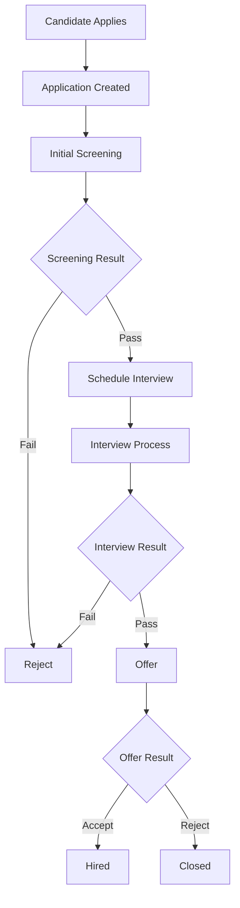
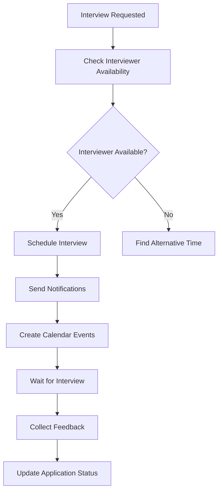
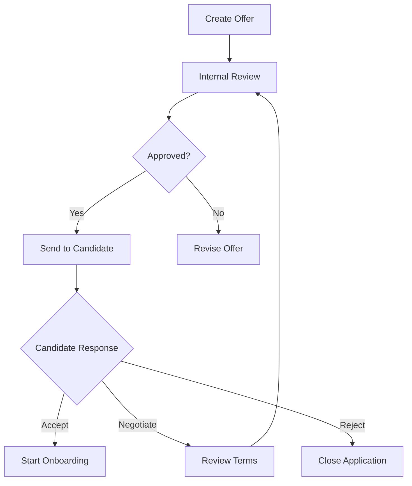

# ATS Database Structure

## Table of Contents
- [Overview](#overview)
- [Database Architecture](#database-architecture)
  - [Multi-tenant Design](#multi-tenant-design)
  - [Core Tables](#core-tables)
- [Workflows](#workflows)
- [Data Access Patterns](#data-access-patterns)
- [Related Documentation](#related-documentation)

> 📌 **Looking for database operations?** Check the [Database Operations Guide](/docs/technical/database-operations.md)

## Related Documentation
- [Database Operations Guide](/docs/technical/database-operations.md) - Detailed operations and maintenance
- [API Documentation](/docs/api/README.md) - API endpoints and services
- [Performance Best Practices](/docs/guides/best-practices/performance.md) - Performance optimization guidelines
- [Data Management Guide](/docs/guides/best-practices/data-management.md) - Data handling best practices

## Feature Documentation
- [Candidate Pipeline](/docs/features/candidate-pipeline.md) - Candidate tracking workflow
- [Interview Management](/docs/features/structured-interviews.md) - Interview process
- [Analytics Dashboard](/docs/features/analytics-dashboard.md) - Reporting and analytics

## See Also
- [System Configuration](/docs/guides/admin/system-config.md) - Database configuration
- [Backup & Recovery](/docs/guides/admin/backup-recovery.md) - Data backup procedures
- [Monitoring Guide](/docs/guides/admin/monitoring.md) - Database monitoring

## Overview

The ATS application uses a multi-tenant PostgreSQL database architecture designed for scalability, performance, and data isolation. This document outlines the database structure, relationships, and workflows.

## Database Architecture

### Multi-tenant Design
```sql
-- Tenant Management
CREATE TABLE tenants (
    id UUID PRIMARY KEY,
    name VARCHAR(255) NOT NULL,
    domain VARCHAR(255) UNIQUE NOT NULL,
    created_at TIMESTAMP WITH TIME ZONE DEFAULT CURRENT_TIMESTAMP,
    updated_at TIMESTAMP WITH TIME ZONE DEFAULT CURRENT_TIMESTAMP
);

-- Tenant-specific Settings
CREATE TABLE tenant_settings (
    tenant_id UUID REFERENCES tenants(id),
    setting_key VARCHAR(100),
    setting_value JSONB,
    PRIMARY KEY (tenant_id, setting_key)
);
```

### Core Tables

#### User Management
```sql
CREATE TABLE users (
    id UUID PRIMARY KEY,
    tenant_id UUID REFERENCES tenants(id),
    email VARCHAR(255) NOT NULL,
    first_name VARCHAR(100),
    last_name VARCHAR(100),
    role VARCHAR(50),
    permissions JSONB,
    created_at TIMESTAMP WITH TIME ZONE DEFAULT CURRENT_TIMESTAMP,
    updated_at TIMESTAMP WITH TIME ZONE DEFAULT CURRENT_TIMESTAMP,
    UNIQUE (tenant_id, email)
);

CREATE TABLE roles (
    id UUID PRIMARY KEY,
    tenant_id UUID REFERENCES tenants(id),
    name VARCHAR(50) NOT NULL,
    permissions JSONB,
    created_at TIMESTAMP WITH TIME ZONE DEFAULT CURRENT_TIMESTAMP,
    UNIQUE (tenant_id, name)
);
```

#### Job Management
```sql
CREATE TABLE jobs (
    id UUID PRIMARY KEY,
    tenant_id UUID REFERENCES tenants(id),
    title VARCHAR(255) NOT NULL,
    description TEXT,
    requirements TEXT,
    status VARCHAR(50),
    department VARCHAR(100),
    location VARCHAR(255),
    salary_range JSONB,
    created_by UUID REFERENCES users(id),
    created_at TIMESTAMP WITH TIME ZONE DEFAULT CURRENT_TIMESTAMP,
    updated_at TIMESTAMP WITH TIME ZONE DEFAULT CURRENT_TIMESTAMP
);

CREATE TABLE job_skills (
    job_id UUID REFERENCES jobs(id),
    skill_name VARCHAR(100),
    importance VARCHAR(20), -- 'required', 'preferred'
    PRIMARY KEY (job_id, skill_name)
);
```

#### Candidate Management
```sql
CREATE TABLE candidates (
    id UUID PRIMARY KEY,
    tenant_id UUID REFERENCES tenants(id),
    email VARCHAR(255) NOT NULL,
    first_name VARCHAR(100),
    last_name VARCHAR(100),
    phone VARCHAR(50),
    location VARCHAR(255),
    resume_url VARCHAR(512),
    status VARCHAR(50),
    source VARCHAR(100),
    created_at TIMESTAMP WITH TIME ZONE DEFAULT CURRENT_TIMESTAMP,
    updated_at TIMESTAMP WITH TIME ZONE DEFAULT CURRENT_TIMESTAMP,
    UNIQUE (tenant_id, email)
);

CREATE TABLE candidate_skills (
    candidate_id UUID REFERENCES candidates(id),
    skill_name VARCHAR(100),
    years_experience INTEGER,
    proficiency_level VARCHAR(20),
    PRIMARY KEY (candidate_id, skill_name)
);
```

#### Application Process
```sql
CREATE TABLE applications (
    id UUID PRIMARY KEY,
    tenant_id UUID REFERENCES tenants(id),
    job_id UUID REFERENCES jobs(id),
    candidate_id UUID REFERENCES candidates(id),
    status VARCHAR(50),
    stage VARCHAR(50),
    applied_at TIMESTAMP WITH TIME ZONE DEFAULT CURRENT_TIMESTAMP,
    updated_at TIMESTAMP WITH TIME ZONE DEFAULT CURRENT_TIMESTAMP,
    UNIQUE (job_id, candidate_id)
);

CREATE TABLE application_stages (
    id UUID PRIMARY KEY,
    tenant_id UUID REFERENCES tenants(id),
    application_id UUID REFERENCES applications(id),
    stage_name VARCHAR(100),
    status VARCHAR(50),
    notes TEXT,
    completed_at TIMESTAMP WITH TIME ZONE,
    created_at TIMESTAMP WITH TIME ZONE DEFAULT CURRENT_TIMESTAMP
);
```

#### Interview Management
```sql
CREATE TABLE interviews (
    id UUID PRIMARY KEY,
    tenant_id UUID REFERENCES tenants(id),
    application_id UUID REFERENCES applications(id),
    interviewer_id UUID REFERENCES users(id),
    type VARCHAR(50),
    status VARCHAR(50),
    scheduled_at TIMESTAMP WITH TIME ZONE,
    duration_minutes INTEGER,
    location VARCHAR(255),
    meeting_link VARCHAR(512),
    created_at TIMESTAMP WITH TIME ZONE DEFAULT CURRENT_TIMESTAMP,
    updated_at TIMESTAMP WITH TIME ZONE DEFAULT CURRENT_TIMESTAMP
);

CREATE TABLE interview_feedback (
    id UUID PRIMARY KEY,
    tenant_id UUID REFERENCES tenants(id),
    interview_id UUID REFERENCES interviews(id),
    reviewer_id UUID REFERENCES users(id),
    rating INTEGER,
    feedback TEXT,
    decision VARCHAR(50),
    created_at TIMESTAMP WITH TIME ZONE DEFAULT CURRENT_TIMESTAMP
);
```

## Workflows

### 1. Candidate Application Workflow


### 2. Interview Scheduling Workflow


### 3. Offer Management Workflow


## Data Access Patterns

### Security and Access Control
- Row-Level Security (RLS) policies ensure data isolation between tenants
- Role-Based Access Control (RBAC) implemented at the database level
- Audit logging for sensitive operations

### Performance Optimization
- Indexes on frequently queried columns
- Materialized views for complex reports
- Partitioning for large tables (applications, candidates)

### Example Queries

#### Candidate Pipeline Analytics
```sql
SELECT 
    jobs.title,
    application_stages.stage_name,
    COUNT(*) as candidate_count
FROM applications
JOIN jobs ON applications.job_id = jobs.id
JOIN application_stages ON applications.id = application_stages.application_id
WHERE applications.tenant_id = :tenant_id
GROUP BY jobs.title, application_stages.stage_name
ORDER BY jobs.title, application_stages.stage_name;
```

#### Time-to-Hire Analysis
```sql
SELECT 
    jobs.title,
    AVG(
        EXTRACT(EPOCH FROM (
            hired_stage.completed_at - applications.applied_at
        ))/86400
    ) as avg_days_to_hire
FROM applications
JOIN jobs ON applications.job_id = jobs.id
JOIN application_stages hired_stage 
    ON applications.id = hired_stage.application_id
    AND hired_stage.stage_name = 'hired'
WHERE applications.tenant_id = :tenant_id
GROUP BY jobs.title;
```

## Backup and Recovery

### Backup Strategy
- Daily full backups
- Continuous WAL archiving
- Point-in-time recovery capability
- Cross-region backup replication

### Disaster Recovery
- Automated failover to standby
- Regular recovery testing
- Documented recovery procedures

## Maintenance

### Regular Tasks
- Index maintenance
- Statistics updates
- Vacuum operations
- Performance monitoring

### Scaling Considerations
- Horizontal scaling through read replicas
- Vertical scaling for write performance
- Connection pooling configuration
- Query optimization guidelines

## Migration Strategy

### Schema Changes
- Use of migrations table
- Forward-only migrations
- Zero-downtime deployment process
- Rollback procedures

### Data Migration
- Batch processing for large datasets
- Progress tracking
- Validation procedures
- Rollback capabilities 